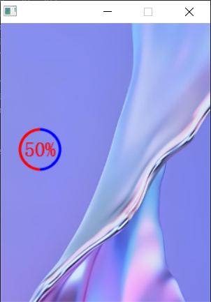

弧形指示器
===========================================

添加弧形指示器代码如下：

.. code-block:: c
   :linenos:

    //定义一个样式，主体颜色为SGL_BLUE，文本颜色为SGL_RED，圆角半径为16
    sgl_style_t arcbar_style = {.body_color = SGL_BLUE, .text_color = SGL_RED};
    //创建一个弧形指示器对象
    sgl_obj_t *arcbar = sgl_arcbar_create(main_page, 50);
    //设置弧形指示器的大小为宽100和高100
    sgl_obj_set_size(arcbar, 50, 50);
    //设置弧形指示器的样式为arcbar_style
    sgl_obj_set_style(arcbar, &arcbar_style);
    //设置弧形指示器的位置为x坐标170, y坐标120
    sgl_obj_set_pos(arcbar, 20, 120);
    //设置弧形指示器的字体
    sgl_arcbar_set_font(arcbar, &song23);
    //设置弧形指示器的厚度为10
    sgl_arcbar_set_thick(arcbar, 3);

