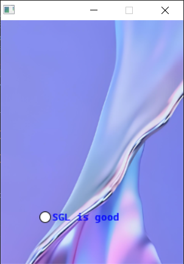

单选框
========================================

SGL中的单选框可以使用如下代码实现：

.. code-block:: c
   :linenos:

    //创建一个样式，主体颜色为SGL_BLACK，文本颜色为SGL_BLUE，圆角半径为3
    sgl_style_t radio_style = {.body_color = SGL_BLACK, .text_color = SGL_BLUE, .radius = 3};
    //创建一个单选框对象
    sgl_obj_t *radio = sgl_radiobtn_create(main_page, true);
    //设置单选框的尺寸为宽150和高16
    sgl_obj_set_size(radio, 150, 16);
    //设置单选框的位置为x坐标50, y坐标250
    sgl_obj_set_pos(radio, 50, 250);
    //设置单选框的点击事件回调函数
    sgl_obj_set_event_cb(radio, btn_event, NULL);
    //设置单选框的样式
    sgl_obj_set_style(radio, &radio_style);
    //设置单选框的字体
    sgl_radiobtn_set_font(radio, &cascadia_mono17);
    //设置单选框的文本
    sgl_radiobtn_set_text(radio, "SGL is good");

